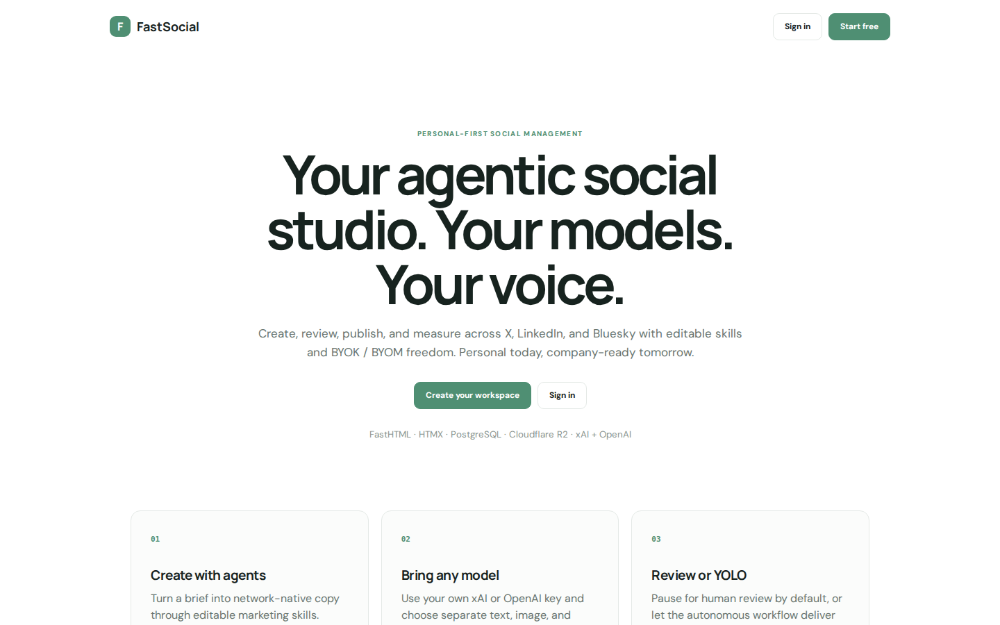
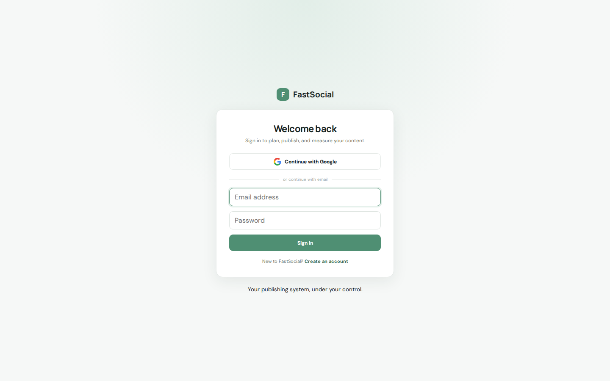
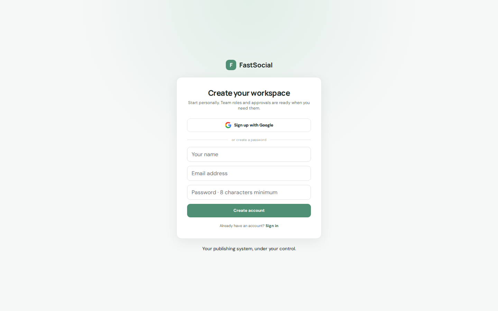

# FastSocial Platform Guide

**Published:** 2026-08-19
**Platform:** [https://fastsocial.org](https://fastsocial.org)
**Source:** [github.com/predictivelabsai/FastSocial](https://github.com/predictivelabsai/FastSocial)

## Platform overview

FastSocial is a personal-first, team-ready social media management system built with Python, FastHTML, HTMX, PostgreSQL, and Cloudflare R2. It publishes directly to X, LinkedIn, and Bluesky, and supports Facebook, Instagram, Threads, TikTok, YouTube, Pinterest, Google Business, and Twitch through configurable Arcade/Co

This visual guide was reviewed against the live product using Playwright. Screens and available navigation can vary by account, role, and deployment configuration.

## 1. Your agentic social studio. Your models. Your voice.

F FastSocial Sign in Start free PERSONAL-FIRST SOCIAL MANAGEMENT Your agentic social studio. Your models. Your voice. Create, review, publish, and measure across X, LinkedIn, and Bluesky with editable skills and BYOK / BYOM freedom. Personal today, company-rea

Screen reviewed at: [https://fastsocial.org/](https://fastsocial.org/)

## 2. Welcome back

F FastSocial Welcome back Sign in to plan, publish, and measure your content. Continue with Google or continue with email Sign in New to FastSocial? Create an account Your publishing system, under your control.

Screen reviewed at: [https://fastsocial.org/signin](https://fastsocial.org/signin)

## 3. Create your workspace

F FastSocial Create your workspace Start personally. Team roles and approvals are ready when you need them. Sign up with Google or create a password Create account Already have an account? Sign in Your publishing system, under your control.

Screen reviewed at: [https://fastsocial.org/register](https://fastsocial.org/register)

## Getting started

Visit [https://fastsocial.org](https://fastsocial.org) to explore FastSocial. For source code and deployment details, use the GitHub link above.
